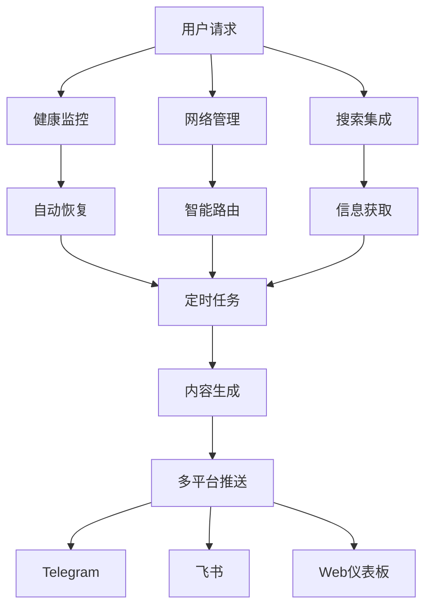

# 🚀 OpenClaw自动化系统

[](https://opensource.org/licenses/MIT)
[](https://www.python.org/downloads/)
[](https://openclaw.ai)

## ✨ 特性

### 🔧 核心功能
- **健康监控** - 24/7系统状态监控，自动恢复
- **网络管理** - 智能代理切换，国内外自动路由
- **搜索集成** - Tavily + Perplexity双引擎搜索
- **定时任务** - 科技头条、投资分析自动推送
- **监控仪表板** - 实时Web界面，移动端友好

### 🎯 实际应用
- 每日双语科技头条自动生成
- 投资分析报告定时推送
- 多平台消息同步（Telegram、飞书）
- 系统健康状态实时监控

## 🚀 快速开始

### 安装
```bash
# 克隆仓库
git clone https://github.com/FounderGeek/openclaw-automation-system.git
cd openclaw-automation-system

# 安装依赖
pip install -r requirements.txt

# 配置环境
cp .env.example .env
# 编辑.env文件，添加你的API密钥
```

### 基础使用
```python
from monitor.founder_health_monitor import HealthMonitor
from network.founder_network_manager import NetworkManager

# 启动健康监控
monitor = HealthMonitor()
monitor.start()

# 检查网络状态
network = NetworkManager()
status = network.check_status()
print(f"网络状态: {status}")
```

## 📊 系统架构



## 🛠️ 配置指南

### 1. API密钥配置
在`.env`文件中配置：
```env
# 搜索API
TAVILY_API_KEY=your_tavily_key
PERPLEXITY_API_KEY=your_perplexity_key

# 消息平台
TELEGRAM_BOT_TOKEN=your_telegram_token
FEISHU_BOT_TOKEN=your_feishu_token

# 其他配置
TIMEZONE=Asia/Shanghai
LOG_LEVEL=INFO
```

### 2. 定时任务配置
编辑`config/schedule.json`：
```json
{
  "tech_headlines": {
    "enabled": true,
    "schedule": "0 8 * * *",
    "timezone": "Asia/Shanghai"
  },
  "investment_analysis": {
    "enabled": true,
    "schedule": "0 18 * * *",
    "timezone": "Asia/Shanghai"
  }
}
```

## 📈 使用案例

### 案例1：每日科技头条
```python
from tasks.tech_headlines import TechHeadlines

headlines = TechHeadlines()
# 生成今日头条
today_headlines = headlines.generate()
# 推送到Telegram
headlines.send_to_telegram(today_headlines)
```

### 案例2：投资分析
```python
from tasks.investment_analysis import InvestmentAnalyzer

analyzer = InvestmentAnalyzer()
# 分析今日市场
analysis = analyzer.analyze()
# 生成报告
report = analyzer.generate_report(analysis)
# 发送邮件
analyzer.send_email_report(report)
```

## 🤝 贡献指南

欢迎贡献！请阅读[贡献指南](docs/CONTRIBUTING.md)。

1. Fork本仓库
2. 创建功能分支 (`git checkout -b feature/AmazingFeature`)
3. 提交更改 (`git commit -m 'Add some AmazingFeature'`)
4. 推送到分支 (`git push origin feature/AmazingFeature`)
5. 开启Pull Request

## 📝 许可证

本项目采用MIT许可证 - 查看[LICENSE](LICENSE)文件了解详情。

## 🙏 致谢

- [OpenClaw](https://openclaw.ai) - 强大的AI代理平台
- [Tavily](https://tavily.com) - AI搜索API
- [Perplexity AI](https://www.perplexity.ai) - AI搜索增强

## 📞 联系

- 问题反馈：[Issues](https://github.com/FounderGeek/openclaw-automation-system/issues)
- 功能请求：[Discussions](https://github.com/FounderGeek/openclaw-automation-system/discussions)
- 邮箱：foundergeek@example.com

---

**⭐ 如果这个项目对你有帮助，请给个star！**