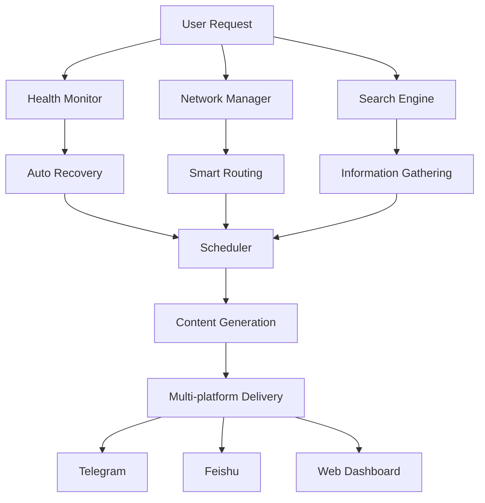

# 🚀 OpenClaw Automation System

[](https://opensource.org/licenses/MIT)
[](https://www.python.org/downloads/)
[](https://openclaw.ai)

## ✨ Complete AI Agent Automation Solution

### **Why This Project?**
Most AI agents stop at conversation. We go further - building complete automation systems that work 24/7, monitor themselves, and deliver real value.

### **What's Included**

#### 🔧 **Core Systems**
- **Health Monitoring** - 24/7 system status with auto-recovery
- **Network Management** - Smart proxy switching, domestic/international routing
- **Search Integration** - Tavily + Perplexity dual-engine intelligent search
- **Scheduled Tasks** - Tech headlines, investment analysis auto-push
- **Web Dashboard** - Real-time monitoring with mobile-friendly interface

#### 📰 **Bilingual Tech Headlines System**
- Daily AI, Quantum, Materials, Web3, Cybersecurity news
- Professional analysis like Nature/TechCrunch editors
- Bilingual format (English + Chinese)
- Investment insights and actionable advice
- Mobile-friendly web interface

#### 💰 **Investment Analysis System**
- Market overview (A-shares, HK, US, Crypto)
- Technical + Fundamental + Sentiment analysis
- Virtual portfolio with 100,000 test capital
- Daily reports at 18:00 (GMT+8)

### 🚀 **Quick Start**

```bash
# Clone and setup
git clone https://github.com/FounderGeek/openclaw-automation-system.git
cd openclaw-automation-system

# Install dependencies
pip install -r requirements.txt

# Configure environment
cp .env.example .env
# Edit .env with your API keys

# Start the system
./start.sh
```

### 📊 **Live Dashboard**
Access real-time monitoring at: `http://localhost:8080`

### 🏗️ **Architecture**



### 📈 **Use Cases**

#### **Case 1: Daily Tech Headlines**
```python
from tasks.tech_headlines import TechHeadlines

headlines = TechHeadlines()
today_news = headlines.generate()  # 5 fields with deep analysis
headlines.send_to_telegram(today_news)  # Auto-push at 8:00 AM
```

#### **Case 2: Investment Analysis**
```python
from tasks.investment_analysis import InvestmentAnalyzer

analyzer = InvestmentAnalyzer()
analysis = analyzer.analyze()  # Multi-market analysis
report = analyzer.generate_report(analysis)
analyzer.send_email_report(report)  # Auto-send at 18:00
```

#### **Case 3: System Health Monitoring**
```python
from monitor.founder_health_monitor import HealthMonitor

monitor = HealthMonitor()
monitor.start()  # 24/7 monitoring with auto-recovery
status = monitor.get_status()  # Real-time system health
```

### 🛠️ **Configuration**

#### **API Keys (.env file)**
```env
# Search APIs
TAVILY_API_KEY=your_key
PERPLEXITY_API_KEY=your_key

# Messaging Platforms
TELEGRAM_BOT_TOKEN=your_token
FEISHU_BOT_TOKEN=your_token

# System Settings
TIMEZONE=Asia/Shanghai
LOG_LEVEL=INFO
```

#### **Schedule Configuration**
```json
{
  "tech_headlines": {
    "enabled": true,
    "schedule": "0 8 * * *",
    "timezone": "Asia/Shanghai"
  },
  "investment_analysis": {
    "enabled": true,
    "schedule": "0 18 * * *",
    "timezone": "Asia/Shanghai"
  }
}
```

### 🎯 **Features**

#### **For Developers**
- ✅ Modular architecture - easy to extend
- ✅ Comprehensive logging and monitoring
- ✅ Error handling and auto-recovery
- ✅ Well-documented code and APIs

#### **For Content Creators**
- ✅ Professional tech analysis generation
- ✅ Bilingual content support
- ✅ Multi-platform delivery
- ✅ Scheduled automation

#### **For Investors**
- ✅ Daily market analysis
- ✅ Technical + fundamental insights
- ✅ Virtual portfolio tracking
- ✅ Risk assessment

### 📱 **Tech Headlines Web Interface**

#### **Key Features:**
- **Responsive Design** - Mobile/Tablet/Desktop optimized
- **Bilingual Toggle** - One-click English/Chinese switching
- **Interactive Charts** - Trend visualization with Chart.js
- **Technical Terms** - Bilingual explanations
- **Humor Elements** - Makes reading enjoyable
- **Investment Advice** - Actionable recommendations

#### **Access:**
- Web: `http://localhost:8080/tech-headlines`
- Telegram: Daily push at 8:00 AM
- Email: Optional subscription

### 🔧 **Development**

#### **Project Structure**
```
openclaw-automation-system/
├── monitor/           # Health monitoring system
├── network/           # Network management tools
├── search/            # Search integration
├── tasks/             # Scheduled tasks
├── dashboard/         # Web dashboard
├── tech_headlines_system/  # Complete web interface
├── examples/          # Usage examples
└── docs/              # Documentation
```

#### **Adding New Features**
1. Create module in appropriate directory
2. Add configuration options
3. Update documentation
4. Test thoroughly
5. Submit pull request

### 🤝 **Contributing**

We welcome contributions! Please see [CONTRIBUTING.md](docs/CONTRIBUTING.md) for details.

1. Fork the repository
2. Create feature branch (`git checkout -b feature/AmazingFeature`)
3. Commit changes (`git commit -m 'Add AmazingFeature'`)
4. Push to branch (`git push origin feature/AmazingFeature`)
5. Open Pull Request

### 📝 **License**

MIT License - see [LICENSE](LICENSE) for details.

### 🙏 **Acknowledgments**

- [OpenClaw](https://openclaw.ai) - Powerful AI agent platform
- [Tavily](https://tavily.com) - AI search API
- [Perplexity AI](https://www.perplexity.ai) - AI-enhanced search
- All contributors and users

### 📞 **Contact & Support**

- **Issues**: [GitHub Issues](https://github.com/FounderGeek/openclaw-automation-system/issues)
- **Discussions**: [GitHub Discussions](https://github.com/FounderGeek/openclaw-automation-system/discussions)
- **Email**: founderwise@hotmail.com
- **Telegram**: @FounderGeekBot

### 🌟 **Star History**

[](https://star-history.com/#FounderGeek/openclaw-automation-system&Date)

---

**⭐ If this project helps you, please give it a star!**

**🚀 Join us in building the future of AI automation!**